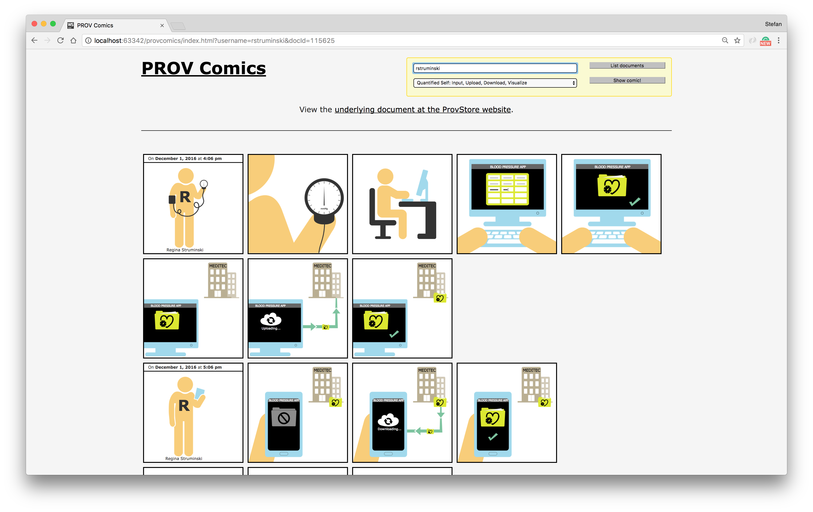

# PROV Comics

Automatically generated Provenance Comics

See live demo: https://dlr-sc.github.io/prov-comics/

## Screenshot

## Development

**No dependencies requires.**

Tested with:

* Firefox 52
* Chrome 57

## Publications

* Schreiber A., Struminski R. (2017) Visualizing Provenance using Comics. 9th USENIX Workshop on the Theory and Practice of Provenance (TaPP 2017), Seattle, WA
* Schreiber A., Struminski R. (2017) Tracing Personal Data Using Comics. In: Antona M., Stephanidis C. (eds) Universal Access in Human–Computer Interaction. Design and Development Approaches and Methods. UAHCI 2017. Lecture Notes in Computer Science, vol 10277. Springer, Cham. DOI: [10.1007/978-3-319-58706-6_36](https://doi.org/10.1007/978-3-319-58706-6_36)
* Schreiber, A., Struminski, R. (2017) Visualizing the Provenance of Personal Data using Comics. Preprints 2017, 2017120153. DOI: [10.20944/preprints201712.0153.v1](https://doi.org/10.20944/preprints201712.0153.v1)
